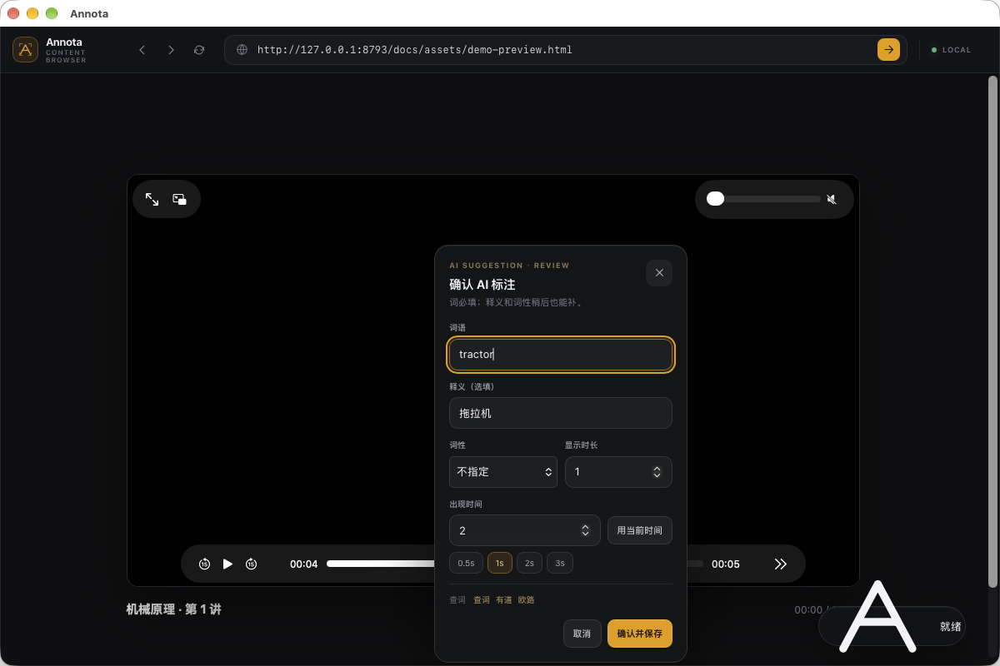
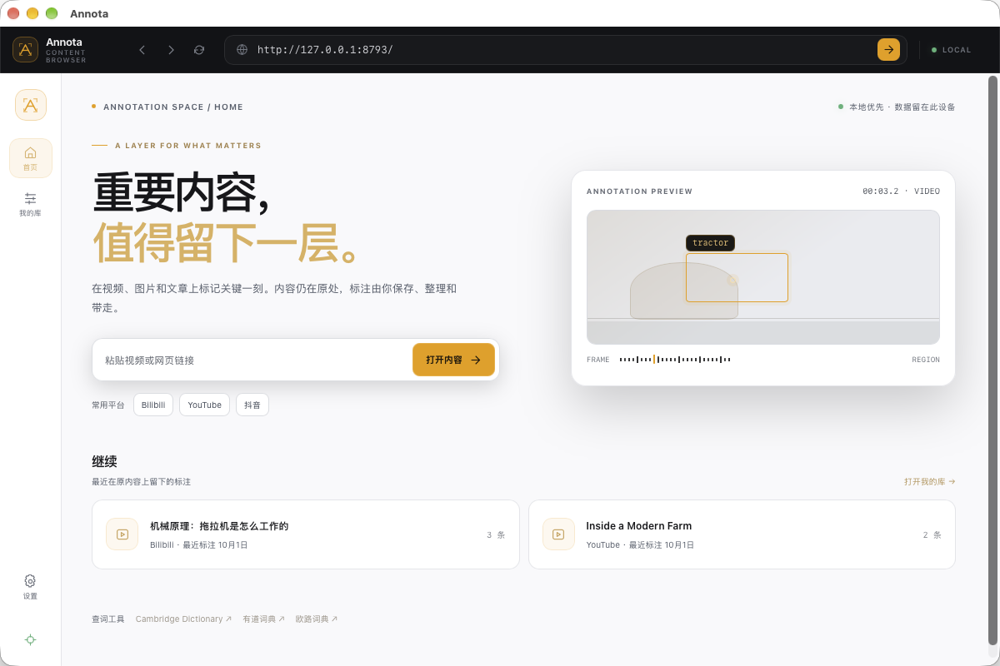
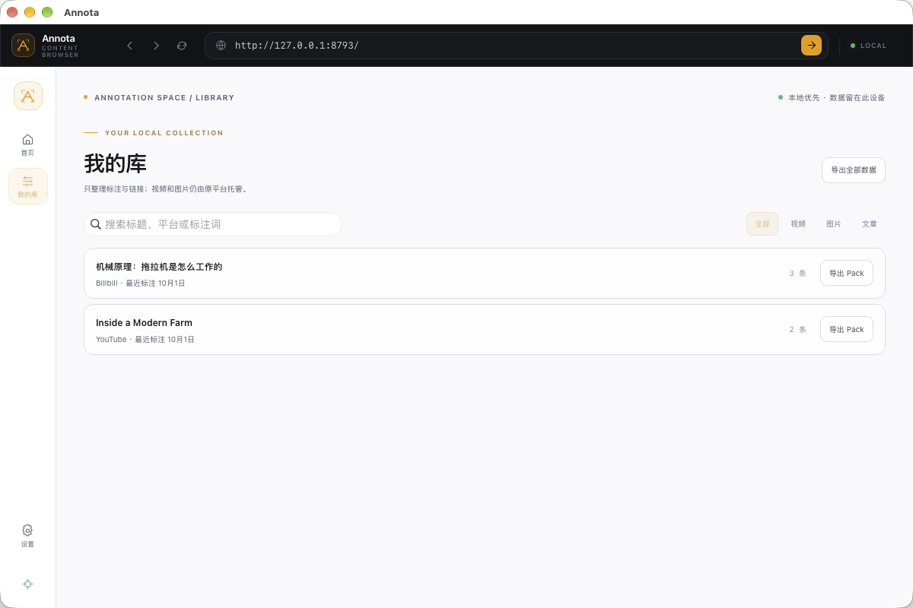
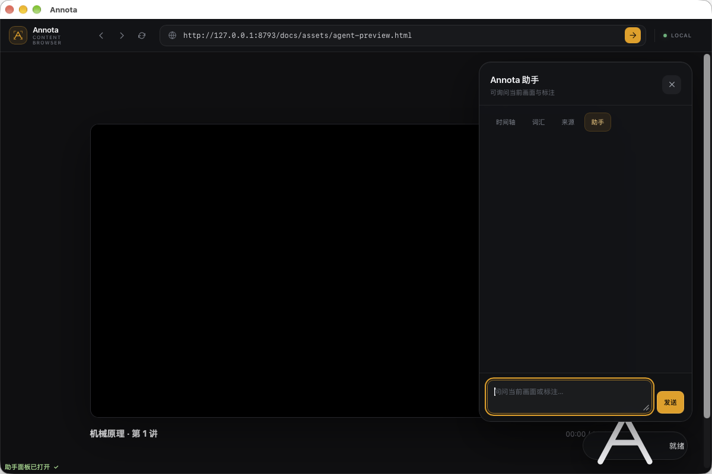
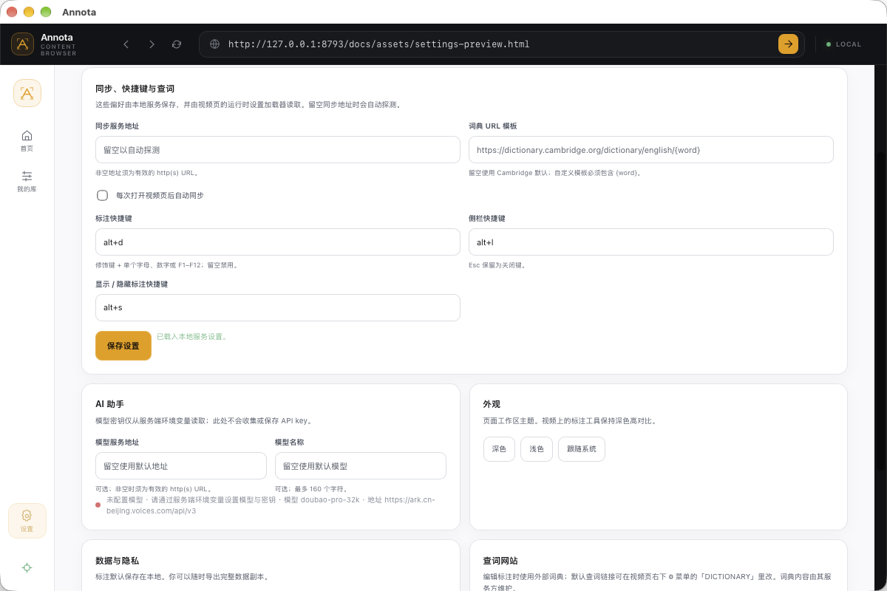

# Annota

**给视频、图片和网页文章加一层可带走的标注：框一块画面、划一段文字，记下你要说的话，它就被钉在这一处。**

[](LICENSE)
[](https://github.com/627-hub/annota/releases)
[](https://627-hub.github.io/annota/)



## 这是什么

看视频、图片或文章时遇到想记的东西，通常只能在另一个 App 里记一行字，跟当时那一处就断了。Annota 把标注直接锚定到**内容本身**：视频里的时间点和画面区域，图片上的框，文章里的选中文字。原内容仍由原平台托管，Annota 只保存你写的那一层标注。

标注默认留在本机，可以导出，也可以同步到自己的设备。数据属于标注者。

## 演示

- **视频**：在画面上框选区域，填词条、释义、词性，绑定出现时间（截图见上）。
- **图片**：在图片上框选区域；长图滚动、窗口缩放、换设备后框位不漂。
- **文章**：选中正文里的一段文字建立文本锚点，重排版后仍能定位。
- 从时间轴、词汇表或来源面板回看，点击跳回对应的画面 / 位置 / 文字。

<details>
<summary>更多界面截图（首页 / 我的库 / 助手面板 / 设置）</summary>









</details>

<!-- 演示视频位：录制完成后，把视频链接或 <video> 放在这里 -->

（演示视频制作中。）

## 功能

**三种媒态**：视频（时间 + 区域）、图片（区域）、文章（选中文字）。一套数据模型通吃，同一份标注可导出、可跨设备渲染。

**智能绑定 + 选对象**：视频页、单图页、文章页自动识别；瀑布流 / 多图页等不确定的页面不瞎猜，点右下「选对象」用鼠标点选要标的图片或正文即可。

**标注**：画面拖框，或正文划词，记录词条、释义、词性。编辑器里可一键外链 Cambridge、有道、欧路查词。图片标注会记录锚定证据，图片换版本时提示复核而不错位。

**回看与管理**：「我的库」汇总本机所有标注，按视频 / 图片 / 文章筛选，支持搜索、直接编辑或删除条目，导出 Pack。

**同步**：本地服务把标注在设备之间同步，去重合并；局域网内手机可只读观看。

**多种用法**：独立桌面浏览器、Chrome / Edge 扩展、userscript，三端共用同一份标注数据。

**开放接口**：桌面端内置 MCP server，可被外部 AI 客户端调用截图、剪贴板、导航、标注操作，以及按时间点查询词条（`words_at`）。桌面端还带一个内置助手后端：设置 `LLM_BASE_URL` / `LLM_API_KEY` / `LLM_MODEL` 后可用，写操作一律先请用户确认。

## 安装

从 [Releases](https://github.com/627-hub/annota/releases) 下载对应版本。

### 桌面版（推荐）

- **macOS**：下载 `Annota_<版本>_aarch64.dmg`，打开后把 Annota 拖进「应用程序」。
  安装包已代码签名并经 Apple 公证；若首次仍被拦截，请在「访达」里右键 Annota → **打开**。
- **Windows**：下载 `Annota_<版本>_x64-setup.exe`，运行安装程序。
  安装包未做代码签名，SmartScreen 可能提示，选择「更多信息 → 仍要运行」。

**自动更新**：桌面版内置版本检查（启动后查一次、之后每 24h 一次），发现新版时工具栏出现「更新到 x.y.z」按钮，点按即下载安装并重启。更新包经 minisign 签名校验。

打开即用：内置起始页、我的库、设置和本地同步服务，不需要额外配置。

### 浏览器扩展

1. 下载 `annota-extension-<版本>.zip` 并解压。
2. 打开 `chrome://extensions`（或 `edge://extensions`），开启「开发者模式」。
3. 点「加载已解压的扩展程序」，选中解压出的目录。

### Userscript

下载 `annotate.user.js`，装进任意用户脚本管理器（桌面 Tampermonkey / Violentmonkey；Apple 平台可用开源的 Userscripts）。观看端专用变体是 `annotate.view.user.js`。

脚本带 `@updateURL`/`@downloadURL`，**装一次即可自动更新**（另有脚本内版本探测兜底提示）；发布用 `sh cloudbase/publish.sh`。

安装细节与移动端用法见 [`docs/install.md`](docs/install.md)、[`docs/mobile.md`](docs/mobile.md)。

## 从源码运行

需要 Rust stable、系统 WebView 构建依赖，以及 Tauri CLI 2：

```bash
cargo install tauri-cli --version '^2' --locked
python3 build.py                    # 生成 userscript 与扩展 core
cd app/annota
cargo tauri dev                     # 开发运行
cargo tauri build                   # 打包 dmg / exe
```

### 开发与验证

```bash
python3 build.py
node --test dev/geometry.test.mjs
node --test dev/textquote.test.mjs
python3 dev/merge_rules.test.py
node dev/smoke.mjs          # 视频
node dev/smoke-image.mjs    # 图片
node dev/smoke-article.mjs  # 文章
node dev/smoke-picker.mjs   # 选对象
(cd app/annota && cargo check)
```

调试图：`dev/demo.html`（视频）、`dev/image.html`（图片）、`dev/article.html`（文章）。

## 文档

| 文档 | 内容 |
|---|---|
| [`docs/product-spec.md`](docs/product-spec.md) | 产品定位、界面规格、路线与决策 |
| [`docs/implementation-plan.md`](docs/implementation-plan.md) | R0–R4 分期与进度 |
| [`docs/roadmap.md`](docs/roadmap.md) | 竞品与差异化、社交层（小组共享）、批量导出规格、R3/R4 分期 |
| [`docs/architecture.md`](docs/architecture.md) | 架构接缝：本地/托管分层、同步分层、身份、公开页（ADR） |
| [`docs/r4-plan.md`](docs/r4-plan.md) | R4 社交层方案：GitStore（GitHub/Gitee）小组共享、组页、版本管理 |
| [`docs/progress-2026-10-03.md`](docs/progress-2026-10-03.md) | 当日进展：R3a 落地、真机验收修复、OCR 审查修复 |
| [`docs/progress-2026-10-03-r4a.md`](docs/progress-2026-10-03-r4a.md) | R4a 小组共享落地：身份/GitStore/组同步/组页 + Gitee 实测 |
| [`docs/r2-plan.md`](docs/r2-plan.md) | R2 多媒态实施方案（图片 / 文章 / 选对象） |
| [`docs/spec.md`](docs/spec.md) | 数据模型、共享协议、模型路线 |
| [`docs/install.md`](docs/install.md) | 各端安装与宿主选择 |
| [`docs/sync.md`](docs/sync.md) | 同步机制 |
| [`docs/mobile.md`](docs/mobile.md) | 移动端只读观看 |
| [`docs/browser.md`](docs/browser.md) | 手机自带油猴浏览器 |

## 安全

数据默认留在本机，服务只监听回环地址。报告漏洞与安全边界见 [`SECURITY.md`](SECURITY.md)。

## 许可证

[Apache-2.0](LICENSE)。
